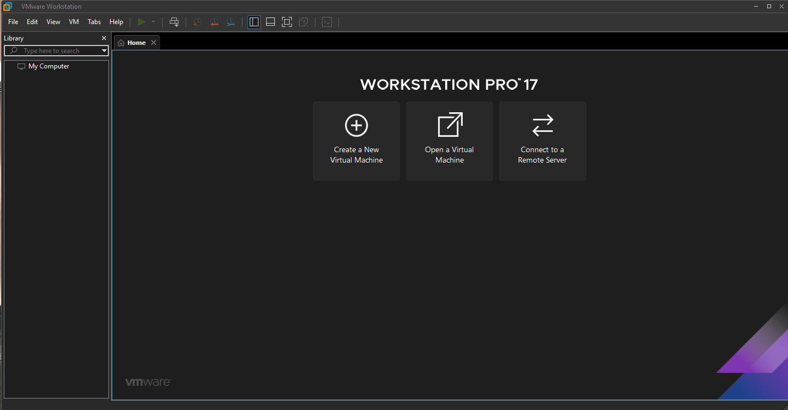
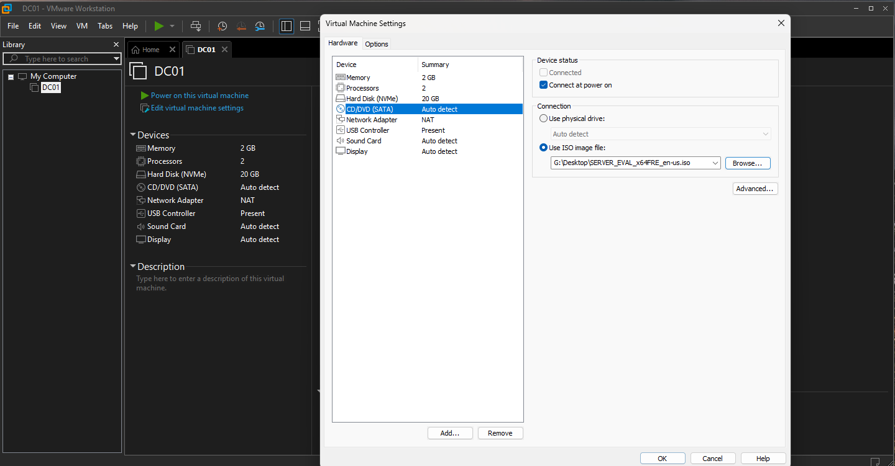
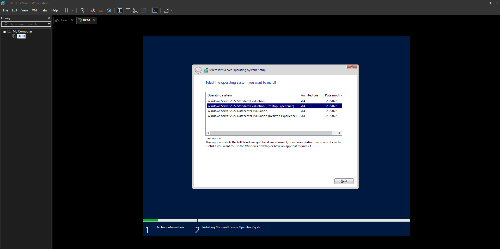
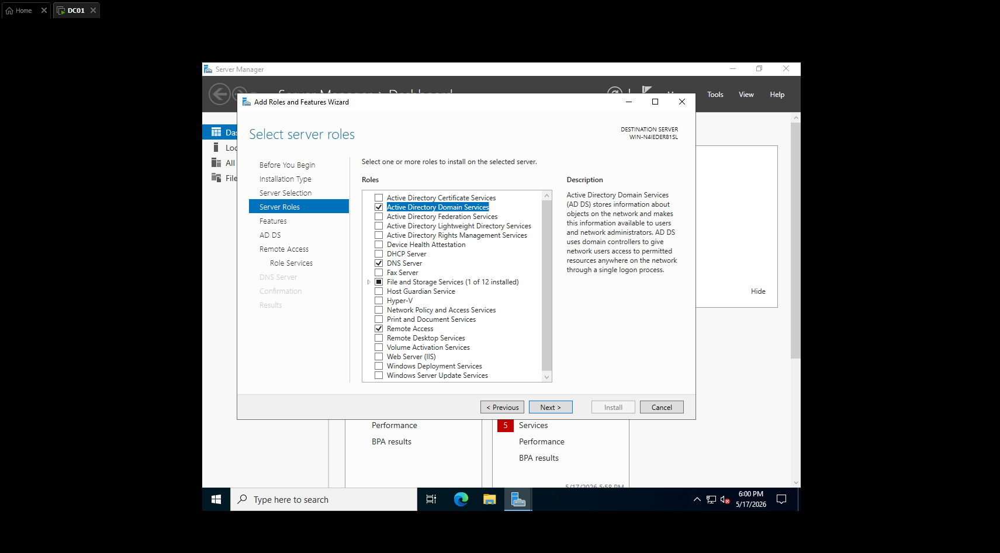
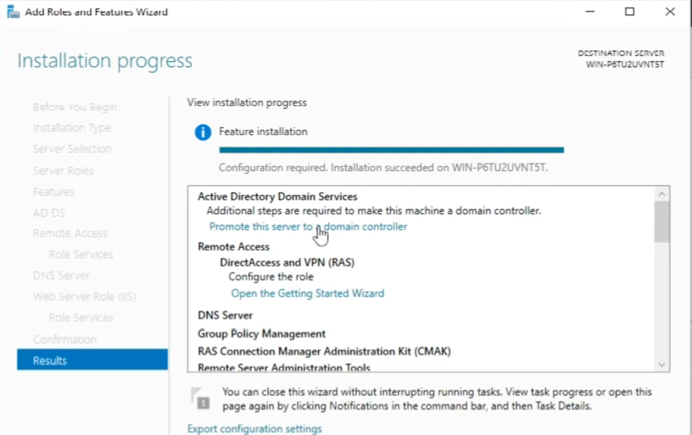
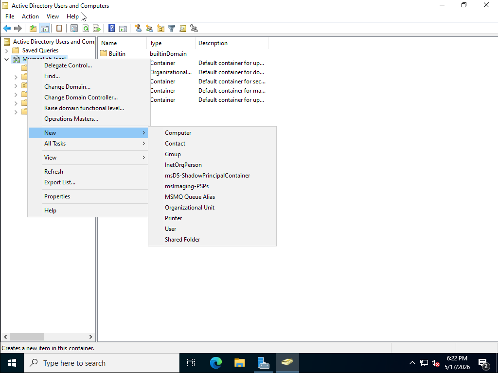
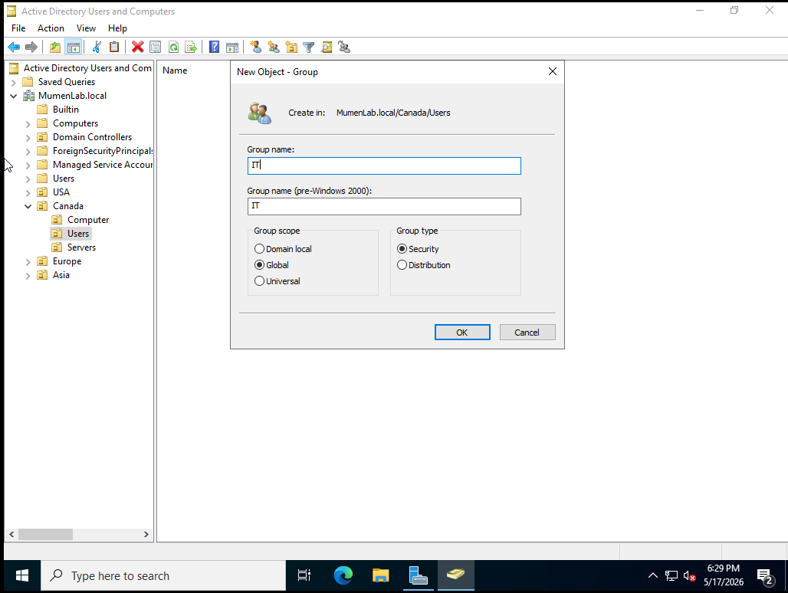
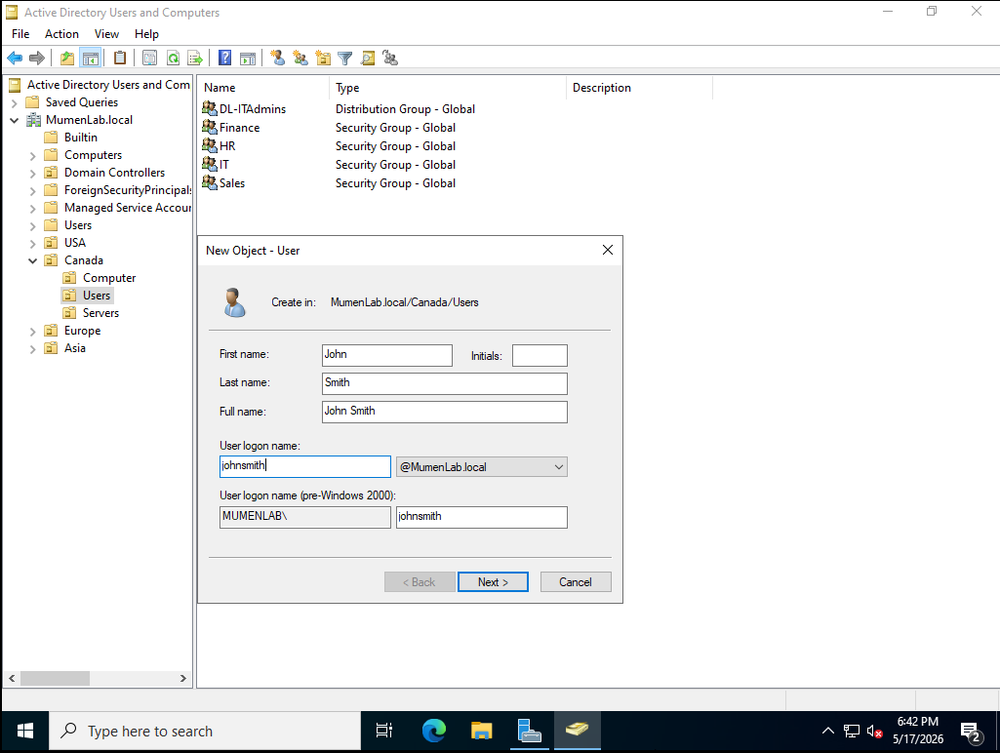
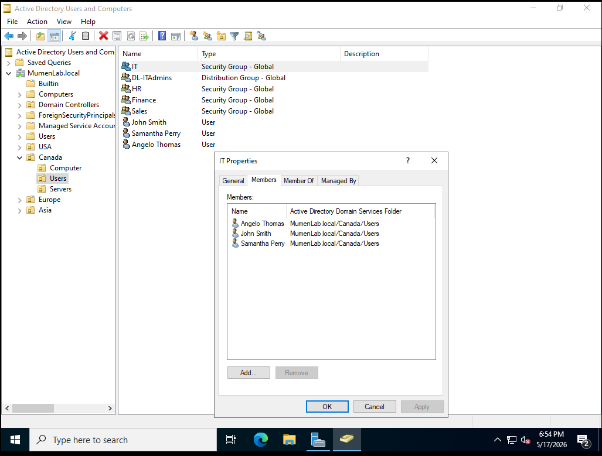

# Active Directory Help Desk Lab - Part 1

## Overview

This project documents Part 1 of my Active Directory home lab built using VMware Workstation Pro and Windows Server 2022. The purpose of this lab is to practice foundational Windows system administration and help desk tasks in a virtual environment.

In this part, I created a Windows Server virtual machine, installed Windows Server 2022, installed Active Directory Domain Services, promoted the server to a domain controller, and created Organizational Units, groups, and users in Active Directory.

This lab simulates a small company environment where users are organized by region, department, and group membership.

---

## Lab Objectives

- Create a Windows Server 2022 virtual machine in VMware Workstation Pro
- Attach a Windows Server ISO file to the virtual machine
- Install Windows Server 2022 with Desktop Experience
- Install the Active Directory Domain Services role
- Promote the server to a domain controller
- Create Organizational Units in Active Directory
- Create Active Directory groups
- Create domain user accounts
- Add users to the correct groups
- Document the process with screenshots

---

## Lab Environment

| Component | Details |
|---|---|
| Hypervisor | VMware Workstation Pro 17 |
| Server OS | Windows Server 2022 |
| Server Name | DC01 |
| Domain | MumenLab.local |
| Main Tool | Active Directory Users and Computers |
| Lab Type | Local virtualized home lab |

---

## Part 1 Scope

This first part focuses on setting up the Active Directory environment and practicing basic account and group management.

Future parts of this lab will include:

- Joining a Windows client to the domain
- Logging in with domain user accounts
- Creating shared folders
- Configuring NTFS and share permissions
- Applying Group Policy Objects
- Resetting passwords
- Unlocking accounts
- Documenting help desk troubleshooting scenarios

---

## 1. Creating the Virtual Machine

The lab started by creating a new virtual machine in VMware Workstation Pro. This virtual machine will be used as the Windows Server 2022 domain controller.



### VM Configuration

| Setting | Value |
|---|---|
| VM Name | DC01 |
| Memory | 2 GB |
| Processors | 2 |
| Disk Size | 20 GB |
| Network Adapter | NAT |
| ISO | Windows Server 2022 Evaluation |

Creating the VM first provides an isolated environment where Active Directory can be installed and tested safely without affecting the host computer.

---

## 2. Attaching the Windows Server ISO

After creating the virtual machine, I attached the Windows Server 2022 ISO file through the virtual CD/DVD drive settings.



This allows the VM to boot from the Windows Server installation media.

---

## 3. Installing Windows Server 2022

During the installation process, I selected:

```text
Windows Server 2022 Standard Evaluation (Desktop Experience)
```



The Desktop Experience version was selected because it includes a graphical user interface. This makes it easier to use tools such as Server Manager and Active Directory Users and Computers while learning Windows Server administration.

---

## 4. Installing Active Directory Domain Services

After Windows Server 2022 was installed, I used Server Manager to install the Active Directory Domain Services role.



### Role Installed

```text
Active Directory Domain Services
```

Active Directory Domain Services allows the server to manage domain users, groups, computers, authentication, and access to network resources.

This is one of the main services used in Windows business environments, especially for user and computer management.

---

## 5. Promoting the Server to a Domain Controller

After installing Active Directory Domain Services, the server required additional configuration. I promoted the server to a domain controller.



A domain controller is responsible for authenticating users and managing directory services in a Windows domain.

### Domain Used

```text
MumenLab.local
```

This domain is used only inside the virtual lab environment.

---

## 6. Creating Organizational Units

After the domain was created, I opened Active Directory Users and Computers and created Organizational Units.



### Organizational Units Created

```text
Canada
├── Computer
├── Users
└── Servers

USA
Europe
Asia
```

Organizational Units are containers used to organize Active Directory objects such as users, computers, and servers.

They are useful because they make administration easier and allow policies to be applied to specific users or computers later.

For example, users can be placed in the `Users` OU, servers can be placed in the `Servers` OU, and workstations can be placed in the `Computer` OU.

---

## 7. Creating Active Directory Groups

Next, I created groups in Active Directory to organize users by department and purpose.



### Groups Created

| Group Name | Group Scope | Group Type | Purpose |
|---|---|---|---|
| IT | Global | Security | Used for IT department users |
| HR | Global | Security | Used for HR department users |
| Finance | Global | Security | Used for Finance department users |
| Sales | Global | Security | Used for Sales department users |
| DL-ITAdmins | Global | Distribution | Used to demonstrate a distribution group |

### Group Scope and Type Explanation

For this lab, the department groups were created as **Global Security Groups**.

Global groups are useful in a single-domain environment because they can be used to organize users with similar roles or departments.

Security groups are used to assign permissions to resources such as folders, printers, and applications.

Distribution groups are mainly used for email distribution and are not used for assigning access permissions.

---

## 8. Creating Domain Users

I then created domain user accounts in Active Directory.



### Example Users Created

| User | Username | Department / Group |
|---|---|---|
| John Smith | johnsmith | IT |
| Samantha Perry | samanthaperry | IT |
| Angelo Thomas | angelothomas | IT |

Example domain login format:

```text
johnsmith@MumenLab.local
```

Creating users in Active Directory is a common help desk and system administration task. In a real workplace, this would be part of the onboarding process for new employees.

---

## 9. Adding Users to Groups

After creating the users, I added them to the correct Active Directory group.



### IT Group Membership

| Group | Members |
|---|---|
| IT | Angelo Thomas |
| IT | John Smith |
| IT | Samantha Perry |

Adding users to groups is important because permissions are usually assigned to groups instead of individual users.

For example, if the IT group is later given access to an IT shared folder, every user inside the IT group will automatically receive that access.

This is easier to manage than assigning permissions to each user one by one.

---

## Skills Demonstrated

- VMware virtual machine setup
- Windows Server 2022 installation
- Active Directory Domain Services installation
- Domain controller promotion
- Active Directory Users and Computers
- Organizational Unit creation
- Domain user account creation
- Security group creation
- Distribution group creation
- Group scope and group type selection
- User group membership management
- Basic Windows Server administration

---

## Help Desk Relevance

This lab demonstrates several tasks that are directly related to entry-level help desk and IT support roles.

| Help Desk Task | Lab Example |
|---|---|
| User account creation | Created domain users in Active Directory |
| User organization | Placed users inside structured OUs |
| Group management | Created department groups |
| Access preparation | Added users to the correct groups |
| Windows Server basics | Installed and configured Windows Server 2022 |
| Active Directory basics | Built and managed a local AD domain |

These are common tasks in IT support environments where help desk technicians often assist with user onboarding, account changes, access requests, and basic Active Directory administration.

---

## Lessons Learned

Through this lab, I learned how to set up the foundation of a Windows Active Directory environment using Windows Server 2022.

I practiced creating a virtual server, installing Active Directory Domain Services, promoting the server to a domain controller, and organizing users with OUs and groups.

The most important takeaway from Part 1 was understanding how Active Directory is structured. Users, groups, and Organizational Units need to be organized properly before applying permissions, Group Policy, or other administrative controls.

This foundation is important for help desk tasks such as onboarding users, assigning access, and troubleshooting account or permission issues.

---

## Next Steps

In Part 2 of this lab, I plan to continue by adding more realistic help desk scenarios.

Planned additions include:

- Opening and using Group Policy Management Console
- Creating a password policy GPO
- Creating an account lockout policy GPO
- Creating a drive mapping GPO
- Creating a desktop wallpaper GPO
- Creating a Control Panel restriction GPO
- Creating a removable USB storage restriction GPO
- Documenting the difference between Computer Configuration and User Configuration
- Documenting the difference between Policies and Preferences

---

