# Active Directory Help Desk Lab - Part 2

## Group Policy Objects Configuration

## Overview

This section documents Part 2 of my Active Directory home lab. In this part, I created and configured several Group Policy Objects (GPOs) using Group Policy Management Console on Windows Server 2022.

The goal of this section is to practice basic Group Policy administration tasks that are commonly used in Windows domain environments. These policies help administrators manage password security, account lockouts, drive mappings, desktop settings, Control Panel access, and removable storage restrictions.

Part 2 focuses only on creating and configuring GPOs. Testing these policies on a domain-joined Windows client will be completed in Part 3.

---

## Lab Environment

| Component | Details |
|---|---|
| Hypervisor | VMware Workstation Pro 17 |
| Server OS | Windows Server 2022 |
| Domain Controller | DC01 |
| Domain | MumenLab.local |
| Tool Used | Group Policy Management Console |
| Lab Type | Local virtualized Active Directory lab |

---

## Objectives

- Open and use Group Policy Management Console
- Create a Password Policy GPO
- Create an Account Lockout Policy GPO
- Create a Drive Mapping GPO
- Create a Desktop Wallpaper GPO
- Create a Restrict Control Panel GPO
- Create a Disable USB Devices GPO
- Understand the difference between Computer Configuration and User Configuration
- Understand the difference between Policies and Preferences
- Document each configured GPO with screenshots

---

## Key Concepts

## Computer Configuration vs User Configuration

Group Policy settings are divided into two main sections: Computer Configuration and User Configuration.

### Computer Configuration

Computer Configuration applies settings to the computer itself, regardless of which user logs in. This is used when the policy should affect the machine or system-level behavior.

Examples from this lab:

| GPO | Why it uses Computer Configuration |
|---|---|
| Password Policy | Password rules are enforced at the domain/computer level |
| Account Lockout Policy | Account lockout rules protect user logins across the domain |
| Disable USB Devices | USB storage restrictions are applied to the computer |

### User Configuration

User Configuration applies settings to user accounts. These settings follow the user when they log in. This is used when the policy should affect the user experience or user-specific settings.

Examples from this lab:

| GPO | Why it uses User Configuration |
|---|---|
| Drive Mapping | Network drives are mapped when the user logs in |
| Desktop Wallpaper | Wallpaper is applied to the user's desktop session |
| Restrict Control Panel | The restriction is applied to the user's access to settings |

---

## Policies vs Preferences

Group Policy settings can also be organized as Policies or Preferences.

### Policies

Policies are enforced by administrators. Users normally cannot change these settings.

Examples from this lab:

| Policy | Purpose |
|---|---|
| Password Policy | Enforces password length, age, and complexity |
| Account Lockout Policy | Locks accounts after failed login attempts |
| Desktop Wallpaper | Prevents users from changing the assigned wallpaper |
| Restrict Control Panel | Blocks access to Control Panel and PC settings |
| Disable USB Devices | Prevents access to removable storage devices |

### Preferences

Preferences are default settings that administrators can apply, but users may be able to modify them later depending on configuration.

Example from this lab:

| Preference | Purpose |
|---|---|
| Drive Mapping | Automatically maps a network drive for users |

In simple terms:

```text
Policies = enforced rules
Preferences = default settings
```

---

## 1. Opening Group Policy Management Console

I opened Group Policy Management Console to manage Group Policy Objects for the domain.

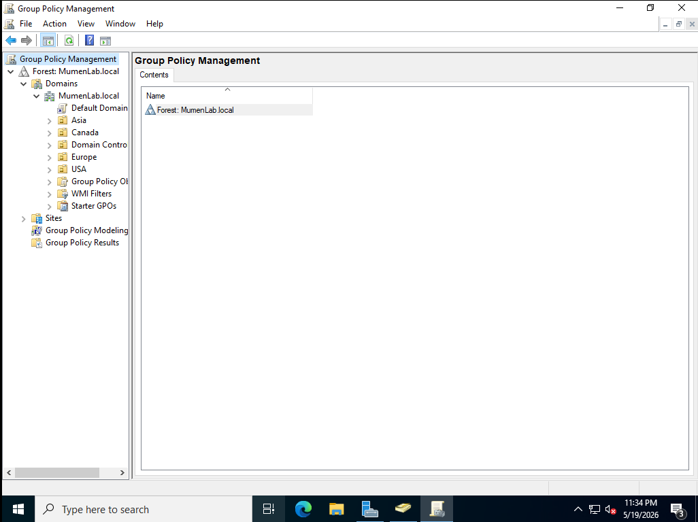

This console allows administrators to create, edit, link, and manage GPOs across domains and Organizational Units.

---

## 2. Creating the Password Policy GPO

I created a new GPO called `Password Policy`.

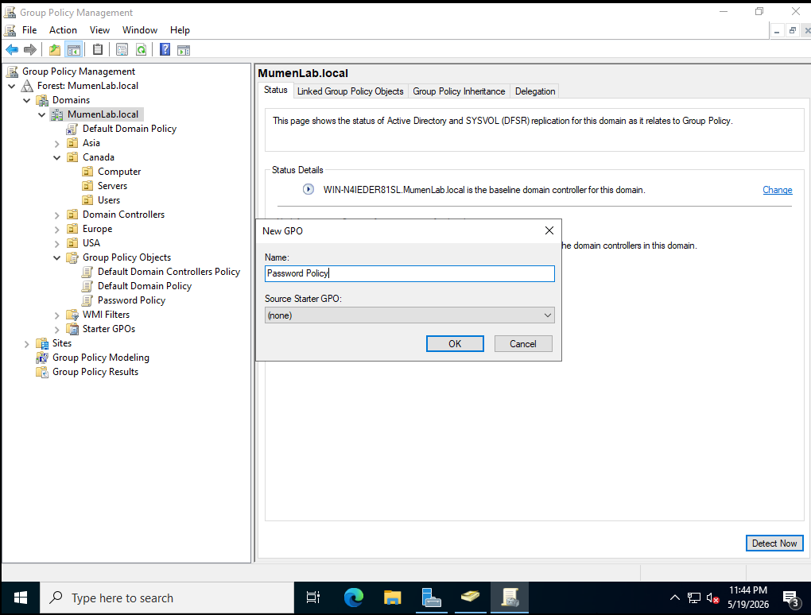

This GPO is used to enforce password requirements for domain users.

### Password Policy Settings

The password policy was configured under:

```text
Computer Configuration
→ Policies
→ Windows Settings
→ Security Settings
→ Account Policies
→ Password Policy
```

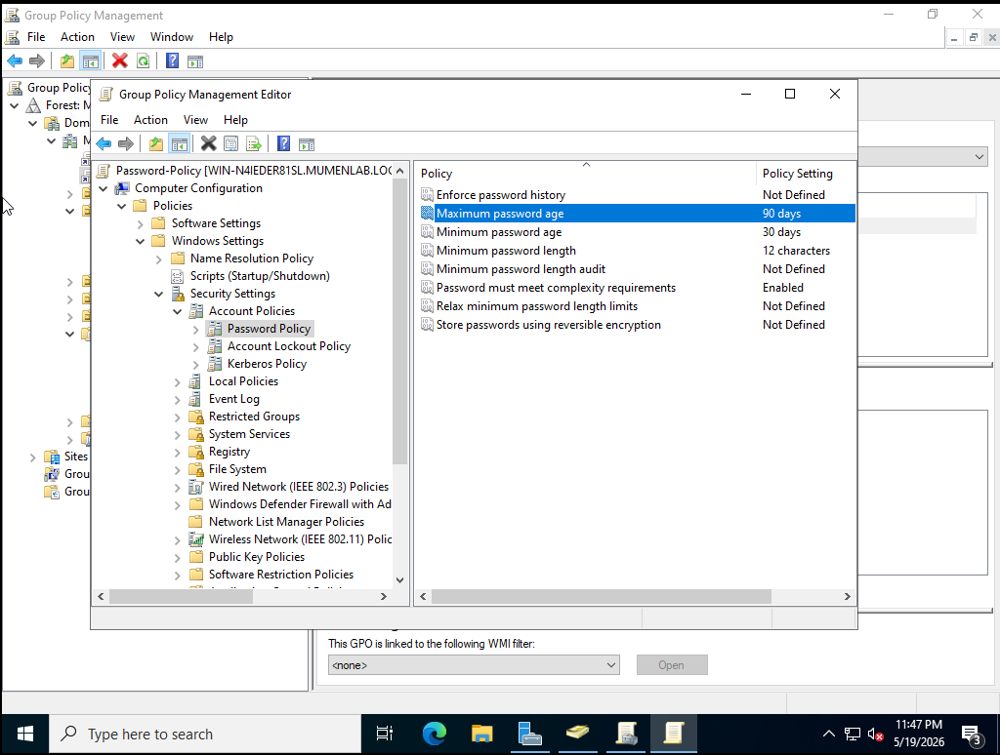

### Configuration Used

| Setting | Value |
|---|---|
| Maximum password age | 90 days |
| Minimum password age | 30 days |
| Minimum password length | 12 characters |
| Password complexity requirements | Enabled |

This policy helps improve account security by requiring stronger passwords and regular password changes.

---

## 3. Creating the Drive Mapping GPO

I created a new GPO called `Drive Mapping`.

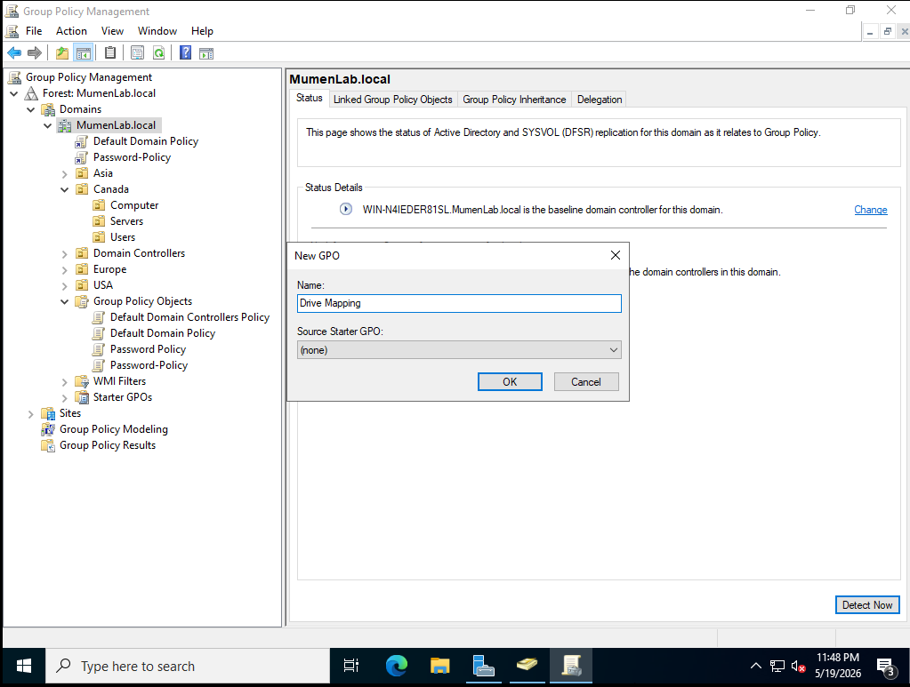

This GPO is used to automatically map a network drive for users when they log in.

### Drive Mapping Settings

The drive mapping was configured under:

```text
User Configuration
→ Preferences
→ Windows Settings
→ Drive Maps
```

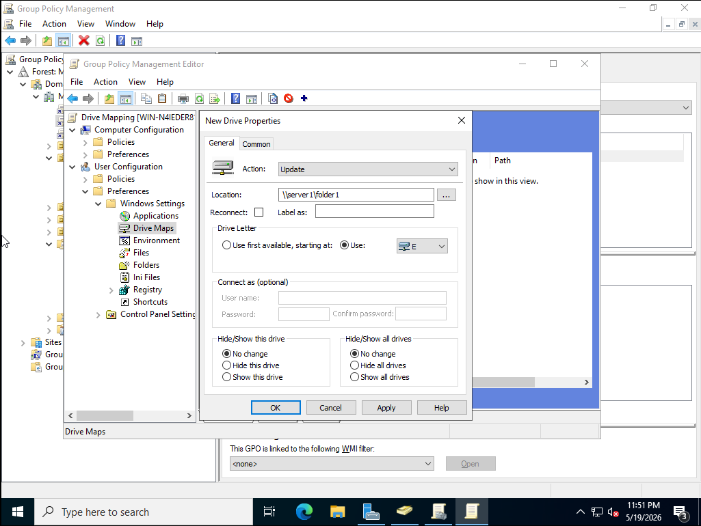

### Configuration Used

| Setting | Value |
|---|---|
| Action | Update |
| Location | `\\server1\folder1` |
| Drive Letter | E: |

This is an example of a Group Policy Preference because it provides a default mapped drive for users.

---

## 4. Creating the Desktop Wallpaper GPO

I created a new GPO called `Desktop Wallpaper`.

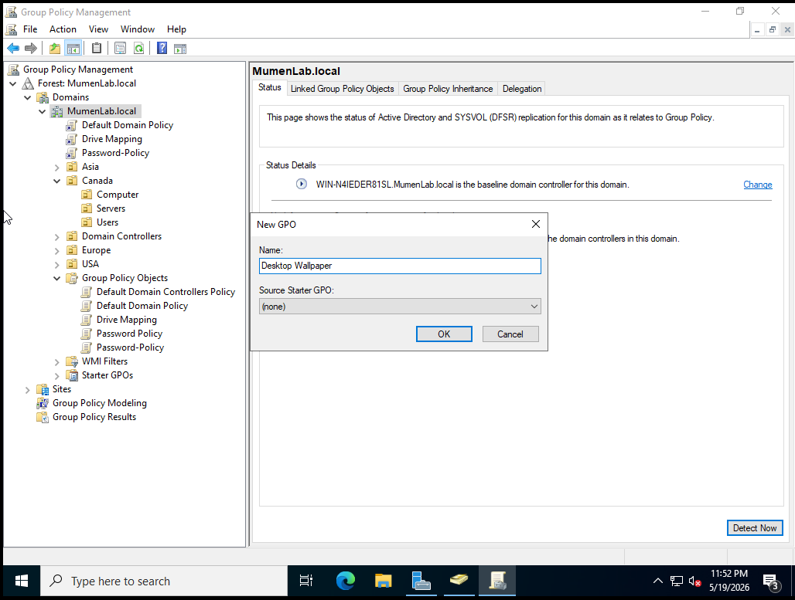

This GPO is used to set a standard desktop wallpaper for users.

### Desktop Wallpaper Settings

The desktop wallpaper policy was configured under:

```text
User Configuration
→ Policies
→ Administrative Templates
→ Desktop
→ Desktop
→ Desktop Wallpaper
```

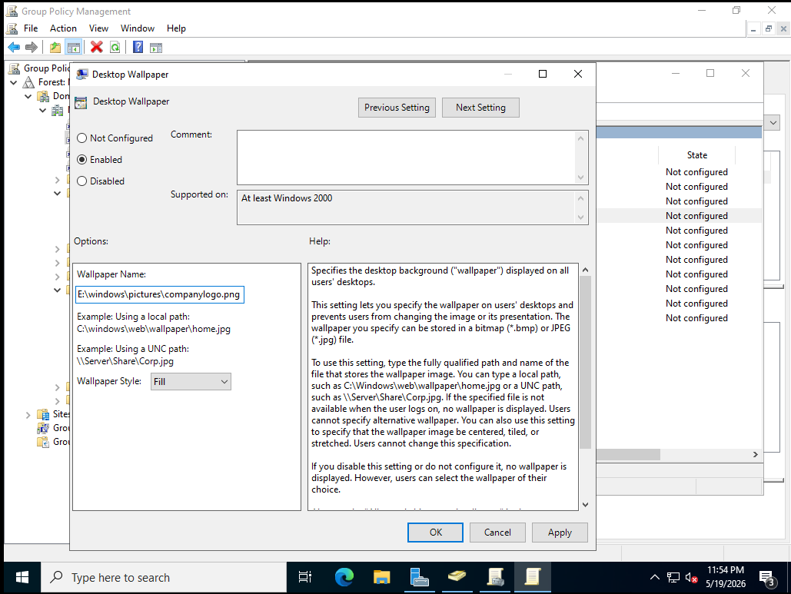

### Configuration Used

| Setting | Value |
|---|---|
| Policy state | Enabled |
| Wallpaper path | `E:\windows\pitures\companylogo.png` |
| Wallpaper style | Fill |

This policy enforces a specific wallpaper and prevents users from changing it.

---

## 5. Creating the Restrict Control Panel GPO

I created a new GPO called `Restrict Control Panel`.

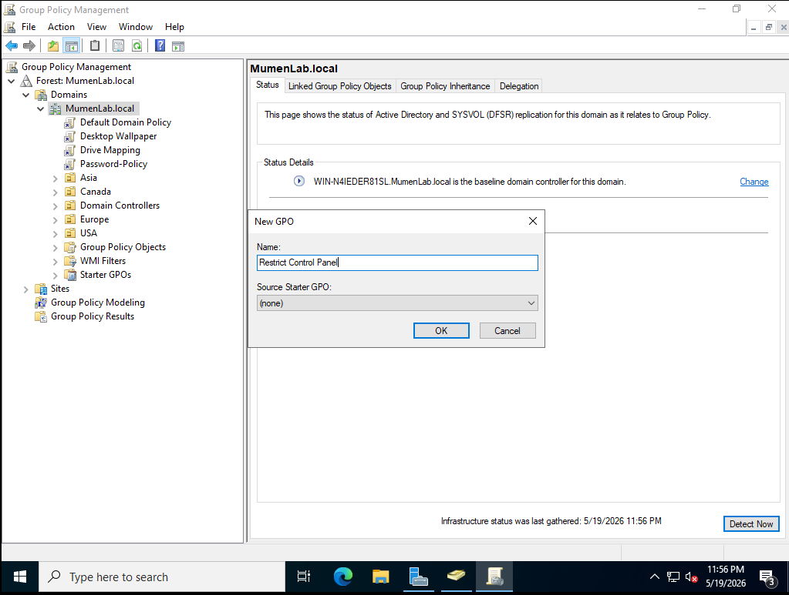

This GPO is used to prevent users from accessing Control Panel and PC settings.

### Control Panel Restriction Settings

The Control Panel restriction was configured under:

```text
User Configuration
→ Policies
→ Administrative Templates
→ Control Panel
→ Prohibit access to Control Panel and PC settings
```

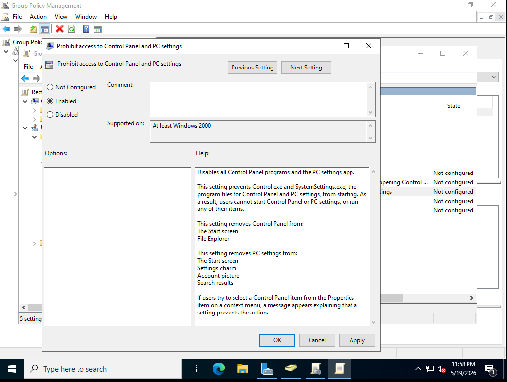

### Configuration Used

| Setting | Value |
|---|---|
| Policy state | Enabled |
| Restriction | Prohibit access to Control Panel and PC settings |

This is useful in business environments because it prevents users from changing system settings that should be managed by IT.

---

## 6. Creating the Disable USB Devices GPO

I created a new GPO called `Disable USB Devices`.

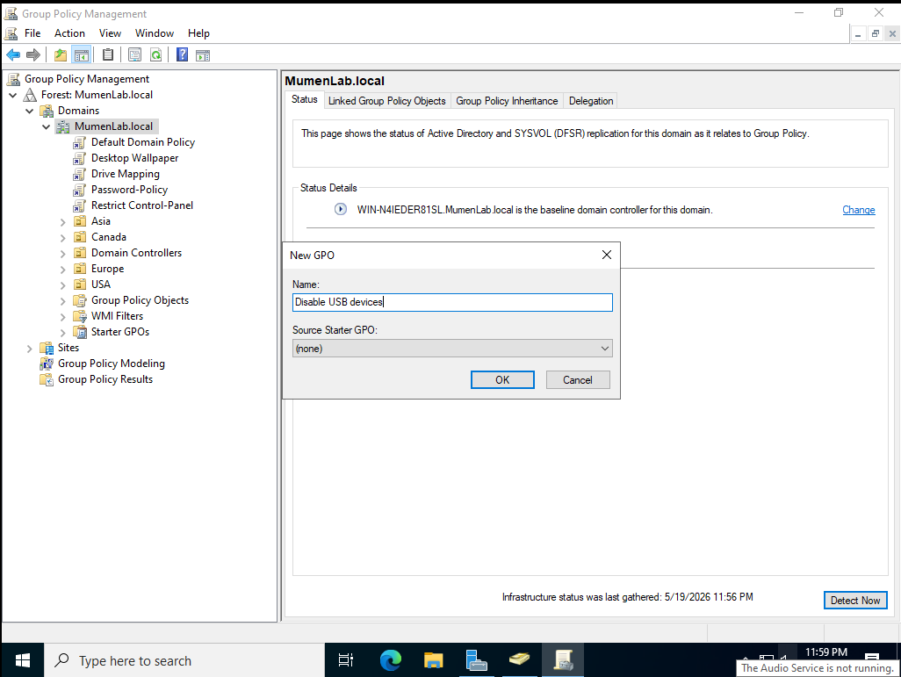

This GPO is used to prevent users from accessing removable storage devices.

### Removable Storage Restriction Settings

The removable storage restriction was configured under:

```text
Computer Configuration
→ Policies
→ Administrative Templates
→ System
→ Removable Storage Access
→ All Removable Storage classes: Deny all access
```

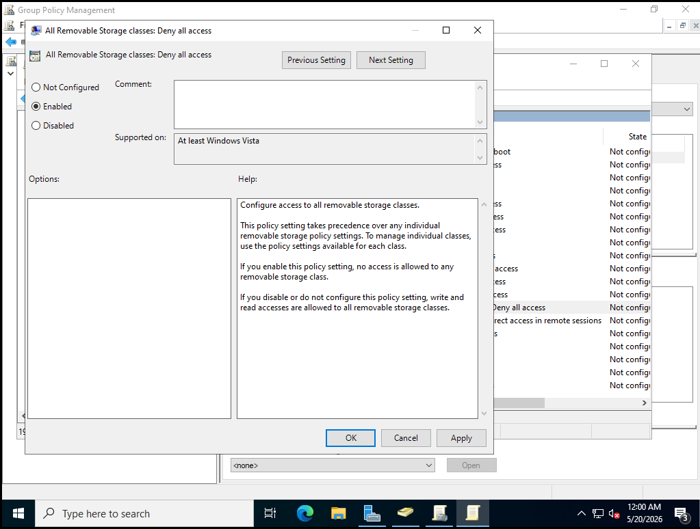

### Configuration Used

| Setting | Value |
|---|---|
| Policy state | Enabled |
| Restriction | Deny all access to removable storage classes |

This policy improves security by reducing the risk of unauthorized file transfers or malware being introduced through USB storage devices.

---

## 7. Creating the Account Lockout Policy GPO

I created a new GPO called `Account Lockout Policy`.

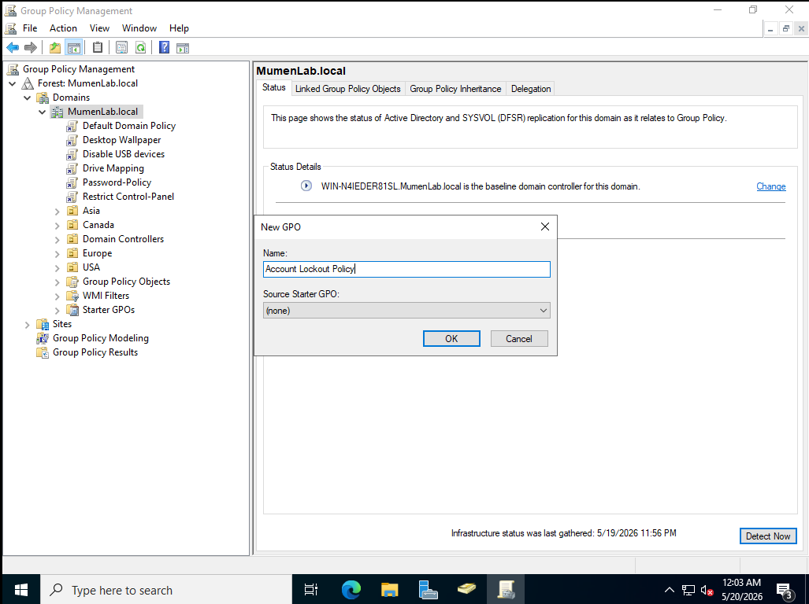

This GPO is used to lock accounts after repeated failed login attempts.

### Account Lockout Policy Settings

The account lockout policy was configured under:

```text
Computer Configuration
→ Policies
→ Windows Settings
→ Security Settings
→ Account Policies
→ Account Lockout Policy
```

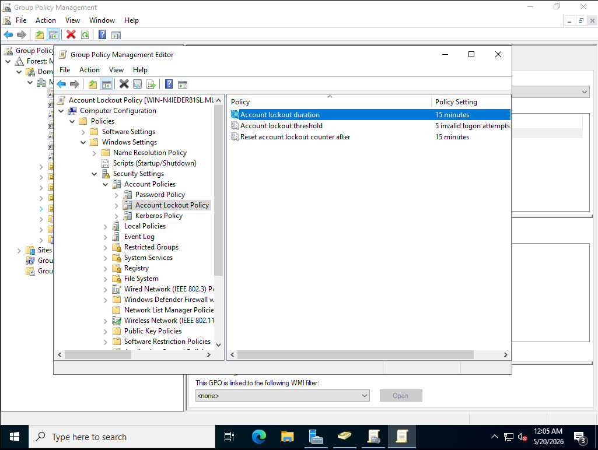

### Configuration Used

| Setting | Value |
|---|---|
| Account lockout duration | 15 minutes |
| Account lockout threshold | 5 invalid logon attempts |
| Reset account lockout counter after | 15 minutes |

This policy is useful for protecting accounts from repeated password guessing attempts. It is also directly related to help desk work because users may contact IT when their account becomes locked.

---

## 8. Final GPO Summary

After creating the GPOs, I reviewed the list of Group Policy Objects in Group Policy Management Console.

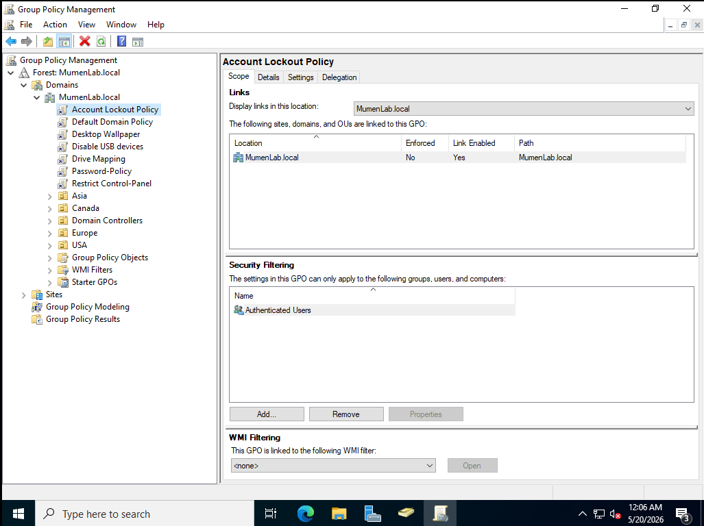

### GPOs Created

| GPO Name | Configuration Type | Policy or Preference | Purpose |
|---|---|---|---|
| Password Policy | Computer Configuration | Policy | Enforces password requirements |
| Account Lockout Policy | Computer Configuration | Policy | Locks accounts after failed login attempts |
| Drive Mapping | User Configuration | Preference | Maps a network drive for users |
| Desktop Wallpaper | User Configuration | Policy | Applies a standard wallpaper |
| Restrict Control Panel | User Configuration | Policy | Blocks Control Panel and PC settings |
| Disable USB Devices | Computer Configuration | Policy | Blocks removable storage access |

---


## Help Desk Relevance

This lab section demonstrates tasks that are useful for help desk and IT support roles.

| Help Desk / IT Task | Lab Example |
|---|---|
| Password policy support | Configured password length, age, and complexity |
| Account lockout troubleshooting | Configured lockout threshold and duration |
| User environment setup | Configured mapped network drive |
| User restrictions | Restricted Control Panel access |
| Endpoint security | Disabled removable USB storage |
| Policy documentation | Documented GPO names, paths, and settings |

These are common concepts in Windows domain environments. Help desk technicians often troubleshoot password issues, account lockouts, access problems, mapped drives, and user restrictions.

---

## Lessons Learned

Through this part of the lab, I learned how Group Policy Objects are used to manage users and computers in an Active Directory domain.

I learned that Computer Configuration applies settings to machines, while User Configuration applies settings to users. I also learned that Policies are enforced rules, while Preferences are default settings that may be changed by users depending on the configuration.

This section helped me understand how administrators use GPOs to improve security, standardize user environments, and reduce manual configuration work.

---

## Next Steps

In Part 3, I plan to test these GPOs on a Windows client VM.

Planned tasks include:

- Create a Windows client virtual machine
- Join the client machine to the `MumenLab.local` domain
- Log in as a domain user
- Run `gpupdate /force`
- Use `gpresult /r` to confirm applied policies
- Test password and account lockout behavior
- Test mapped drive configuration
- Test Control Panel restrictions
- Test removable USB storage restrictions
- Document results with screenshots

---

---
