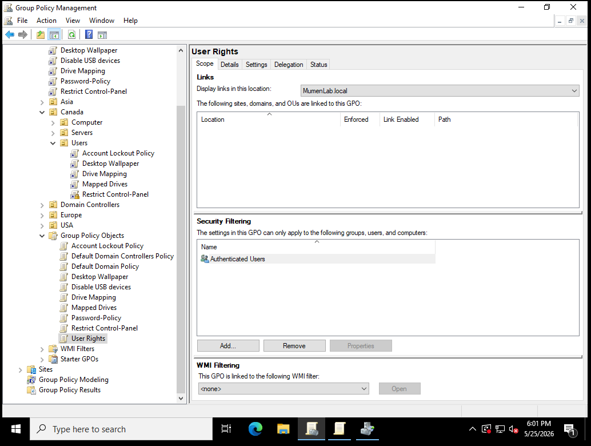
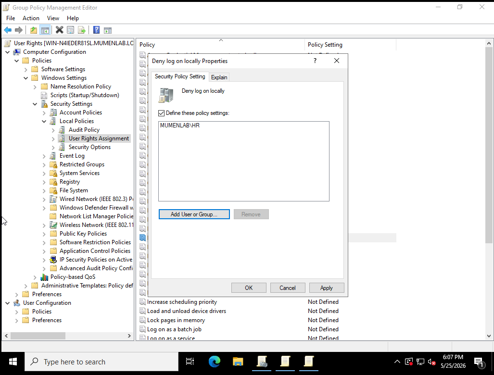
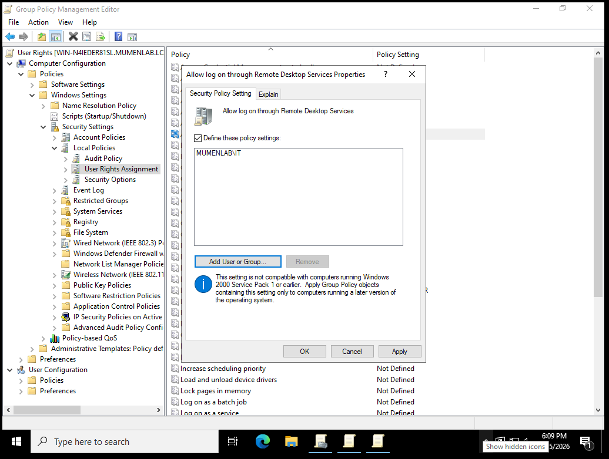
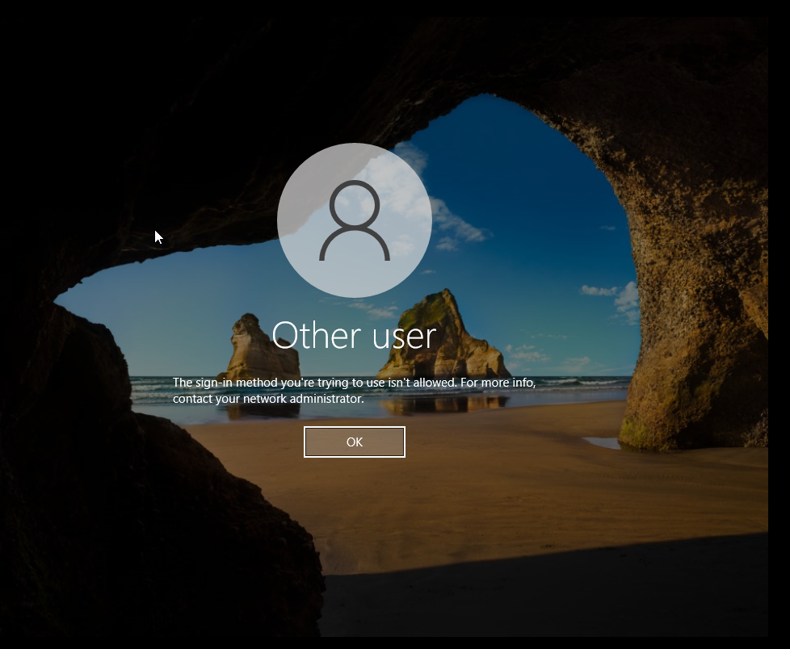
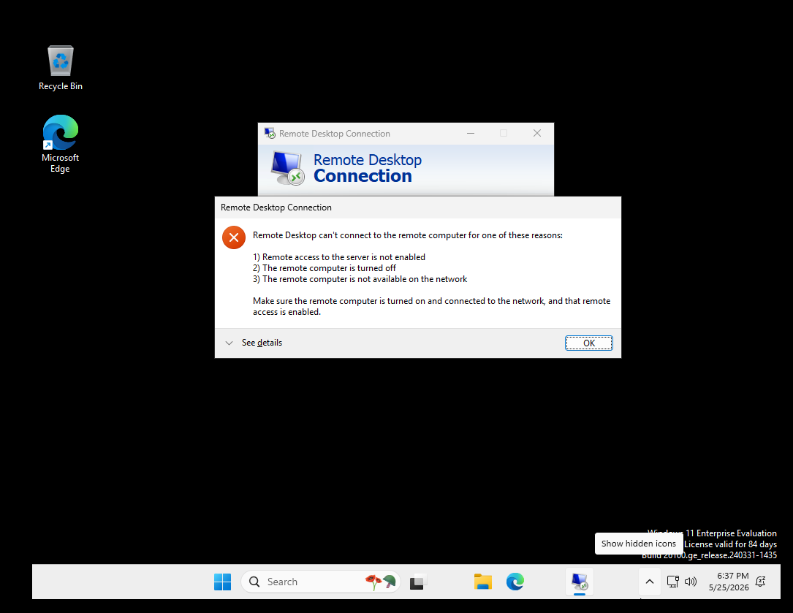
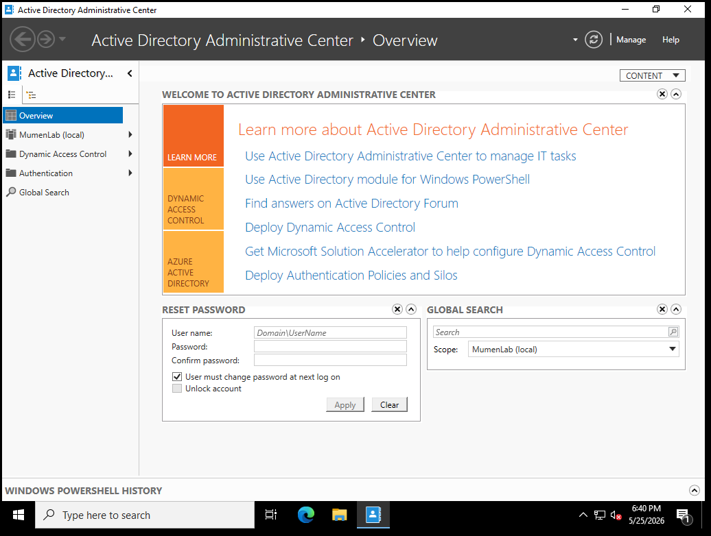
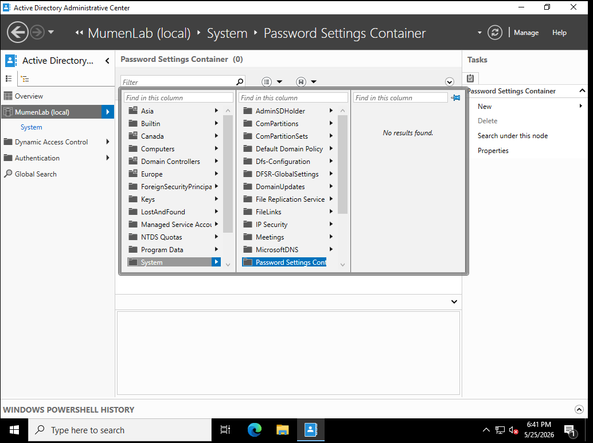
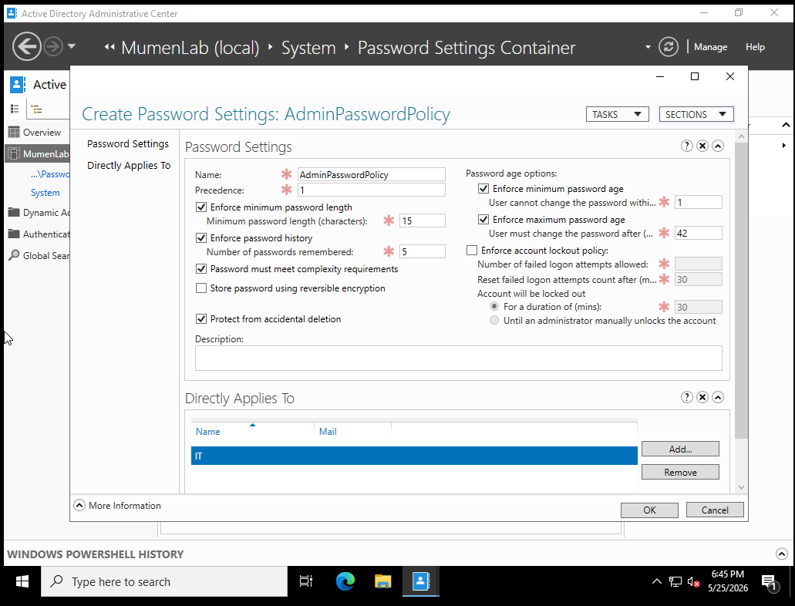
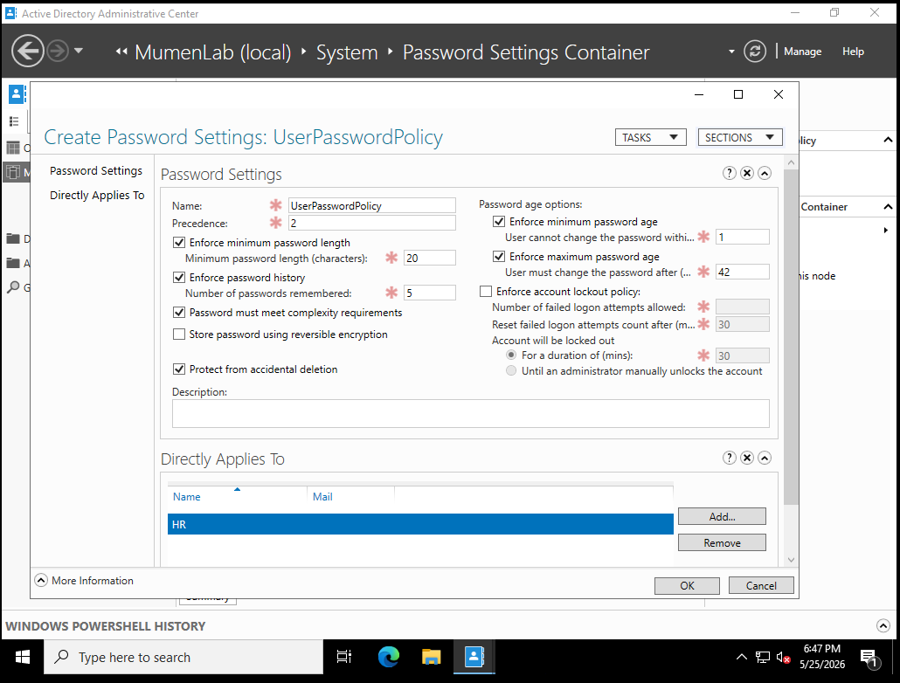
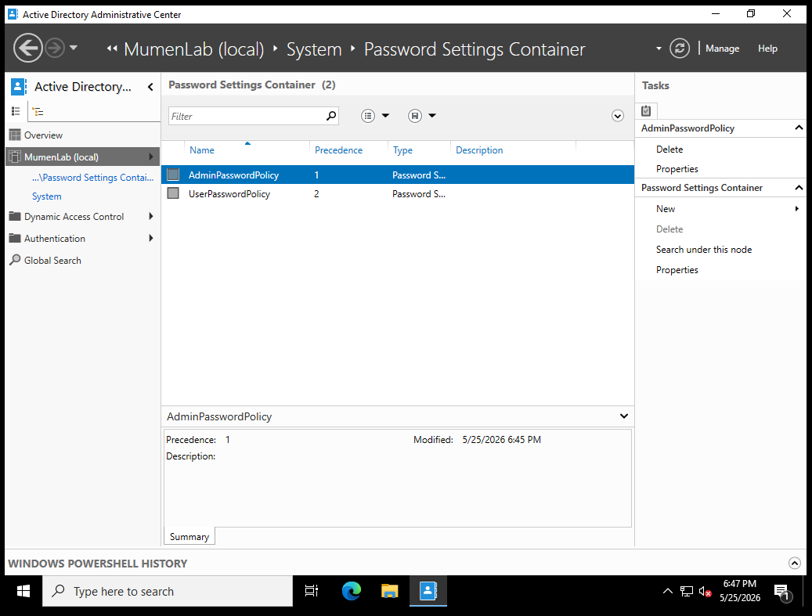

# Active Directory Help Desk Lab - Part 5

## User Rights Assignment and Fine-Grained Password Policies

## Overview

This section documents Part 5 of my Active Directory home lab. In this part, I focused on security policy tasks that were not already fully covered in earlier sections of the project.

Instead of repeating password policy and account lockout testing from previous parts, this section focuses on two new areas: User Rights Assignment and Fine-Grained Password Policies.

The goal of this section is to practice security-focused administration tasks that are common in help desk, desktop support, and junior system administration roles.

---

## Lab Environment

| Component | Details |
|---|---|
| Hypervisor | VMware Workstation Pro 17 |
| Server OS | Windows Server 2022 |
| Domain Controller | DC01 |
| Domain | MumenLab.local |
| Client OS | Windows 10 Enterprise |
| Client Name | COMPUTER01 |
| Main Tools | Group Policy Management Console, Active Directory Users and Computers, Active Directory Administrative Center, Remote Desktop Connection |

---

## Objectives

- Create a User Rights Assignment GPO
- Configure Deny log on locally for selected standard users or groups
- Configure Remote Desktop logon rights
- Test that unauthorized users cannot log on directly to the server
- Test that unauthorized users cannot connect through Remote Desktop
- Open Active Directory Administrative Center
- Locate the Password Settings Container
- Create a Password Settings Object for admin users
- Create a Password Settings Object for standard users
- Confirm that fine-grained password policies were created

---

## Key Concepts

## User Rights Assignment

User Rights Assignment is used to control what users or groups are allowed to do on a Windows system.

Examples include:

- Allowing or denying local logon
- Allowing or denying Remote Desktop logon
- Controlling which users can access servers directly
- Limiting high-risk access to trusted IT users only

This is useful in a workplace because standard users should not be able to log in directly to servers or use Remote Desktop unless they have a business reason.

---

## Fine-Grained Password Policies

Fine-Grained Password Policies allow different password rules to be applied to different users or groups.

This is different from the default domain password policy, which normally applies to the whole domain.

With fine-grained password policies, an organization can create stricter password requirements for privileged accounts such as IT admins while using different requirements for standard users.

These policies are configured using Active Directory Administrative Center through Password Settings Objects.

---

## 1. Creating the User Rights Assignment GPO

I created a new Group Policy Object for user rights security settings.

This GPO is used to manage which users or groups can log on locally or through Remote Desktop.

---

## 2. Configuring Deny Log On Locally

Inside the GPO, I configured the Deny log on locally setting.

This setting prevents selected users or groups from logging directly into the server console.

This is important because regular users should not be able to access domain servers directly.

---

## 3. Configuring Remote Desktop Logon Rights

I also configured Remote Desktop logon rights.

This controls which users or groups are allowed to connect through Remote Desktop Services.

In a real workplace, Remote Desktop access should be limited to approved IT staff or authorized support users.

---

## 4. Testing Local Server Logon Restriction

To test the local logon restriction, I attempted to log in to the server using a regular user account.

The login was denied, confirming that the policy worked.

This is a useful security control because it prevents standard users from accessing servers directly.

---

## 5. Testing Remote Desktop Restriction

I tested Remote Desktop access using a regular user account.

The connection was denied, confirming that the Remote Desktop restriction worked.

This helps reduce the risk of unauthorized remote access to domain systems.

---

## 6. Opening Active Directory Administrative Center

Next, I opened Active Directory Administrative Center.

This tool is used for more advanced Active Directory management tasks, including fine-grained password policies.

---

## 7. Opening the Password Settings Container

Inside Active Directory Administrative Center, I opened the Password Settings Container.

This is where Password Settings Objects are created and managed.

---

## 8. Creating an Admin Password Settings Object

I created a Password Settings Object for admin users.

This policy can be used to apply stricter password requirements to privileged or IT administrator accounts.

Example settings for admin users may include:

- Longer minimum password length
- Password history enforcement
- Higher complexity requirements
- Higher precedence than standard user policies

---

## 9. Creating a Standard User Password Settings Object

I also created a Password Settings Object for standard users.

This allows standard users to have a separate password policy from admin users.

Using separate Password Settings Objects makes password management more flexible than using only one domain-wide password policy.

---

## 10. Confirming the Final Password Settings Objects

I confirmed that the Password Settings Objects were created in the Password Settings Container.

This confirms that fine-grained password policies were configured successfully.

---

## Help Desk Relevance

This lab section demonstrates security administration tasks that are relevant to help desk, desktop support, and junior system administration roles.

| Help Desk / IT Task | Lab Example |
|---|---|
| Access control | Restricted local server logon for standard users |
| Remote access control | Tested Remote Desktop restrictions |
| Security policy management | Created and configured a User Rights Assignment GPO |
| Server protection | Prevented unauthorized users from logging into the server |
| Account policy support | Created fine-grained password policies |
| Admin account protection | Created a separate password policy for admin users |
| AD administration | Used Active Directory Administrative Center |
| Troubleshooting | Tested denied local and remote logon behavior |

These tasks show how security policies can be used to reduce unnecessary access and protect domain systems.

---

## Lessons Learned

Through this part of the lab, I learned how User Rights Assignment can be used to control who can log in locally or remotely to Windows systems.

I also learned that not all password policies need to apply to the whole domain. Fine-Grained Password Policies allow different password rules for different groups, which is useful when privileged accounts need stricter security requirements.

This section also helped me understand the difference between using Group Policy Management Console for system rights and using Active Directory Administrative Center for Password Settings Objects.

---

