# Active Directory Help Desk Lab - Part 7

## NTFS vs Share Permissions

## Overview

This section documents Part 7 of my Active Directory home lab. In this part, I focused on Windows file sharing permissions and practiced different workplace-style access scenarios.

The main goal was to understand the difference between share permissions and NTFS permissions, then apply the correct permissions based on user or department needs.

This part is especially relevant to help desk and IT support because shared folder access issues are common in real environments.

---

## Lab Environment

| Component | Details |
|---|---|
| Hypervisor | VMware Workstation Pro 17 |
| Server OS | Windows Server 2022 |
| Domain Controller | DC01 |
| Domain | MumenLab.local |
| Client OS | Windows 10 Enterprise |
| Main Tools | File Explorer, Active Directory Users and Computers, Share Permissions, NTFS Security Permissions |

---

## Objectives

- Review the difference between share permissions and NTFS permissions
- Configure read-only access for a Marketing Interns group
- Configure a secure HR folder for HR Staff only
- Configure vendor upload access using restrictive permissions
- Configure IT department access to a software folder
- Disable inheritance on a sensitive subfolder
- Apply explicit permissions to a Senior IT group
- Practice realistic shared folder access scenarios

---

## Key Concepts

## Share Permissions

Share permissions control access when users connect to a folder over the network.

Common share permissions include:

- Read
- Change
- Full Control

Share permissions apply only when the folder is accessed through a network path.

---

## NTFS Permissions

NTFS permissions control access to files and folders on the disk itself.

Common NTFS permissions include:

- Full Control
- Modify
- Read & Execute
- List Folder Contents
- Read
- Write

NTFS permissions are more detailed than share permissions and apply to both local and network access.

---

## Most Restrictive Permission Applies

When share permissions and NTFS permissions are both used, the most restrictive effective permission applies.

For example, if a user has Full Control through share permissions but only Read access through NTFS permissions, the user will only have Read access when accessing the folder over the network.

---

## Inherited vs Explicit Permissions

Inherited permissions are passed down from a parent folder to its subfolders and files.

Explicit permissions are assigned directly to a specific folder or file.

In this lab, I disabled inheritance on the Licenses subfolder and gave Senior IT explicit access.

---

## 1. Marketing Folder Permission Scenario

The first scenario involved a Marketing folder where Marketing Interns needed read-only access.

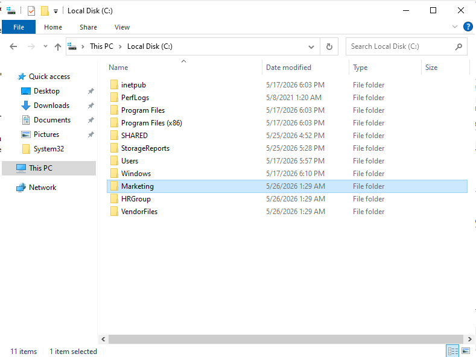

The goal was to let interns view files without allowing them to modify or delete content.

---

## 2. Reviewing Everyone Share Permissions

I checked the share permissions and confirmed the access assigned to Everyone.

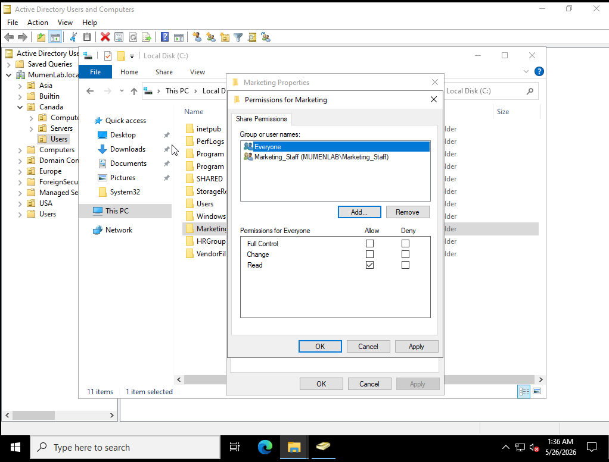

This helped show the difference between general network-level access and more detailed NTFS permissions.

---

## 3. Reviewing Marketing Staff Share Permissions

I also reviewed the Marketing Staff share permissions.

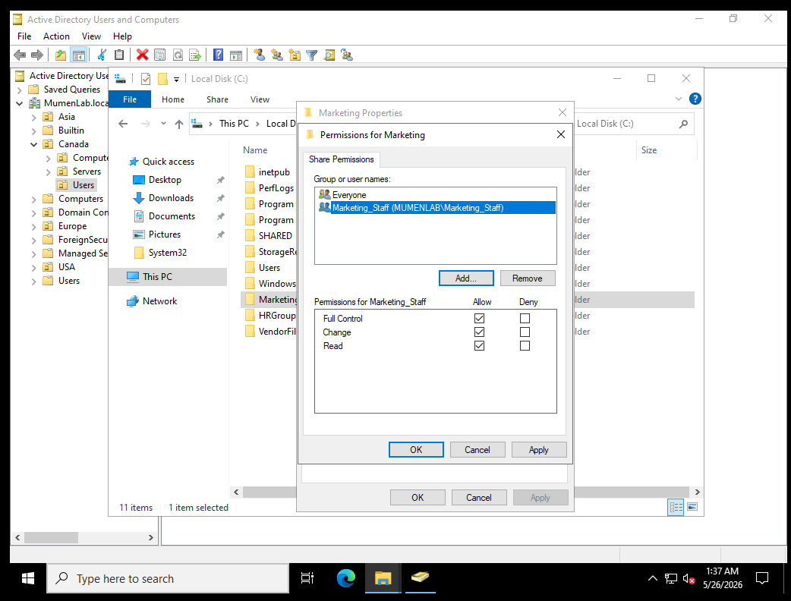

Marketing Staff had higher access than interns because they need to manage the folder content.

---

## 4. Adding Marketing Interns to NTFS Permissions

Next, I added the Marketing Interns group to the NTFS permissions on the Marketing folder.

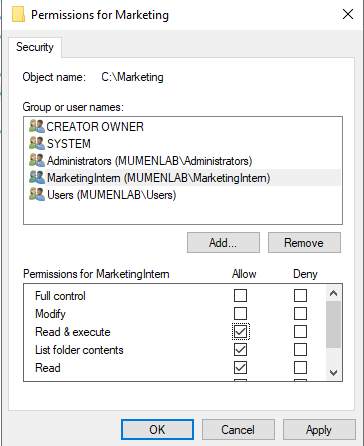

This allowed me to assign a specific permission level to the interns.

---

## 5. Setting Marketing Interns to Read-Only

I configured Marketing Interns with read-only NTFS permissions.

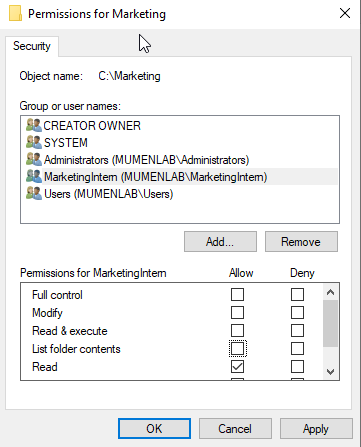

This means interns can view the folder contents but cannot modify or delete files.

---

## 6. HR Folder Sharing Scenario

The next scenario involved an HR folder that should only be accessible to HR Staff.

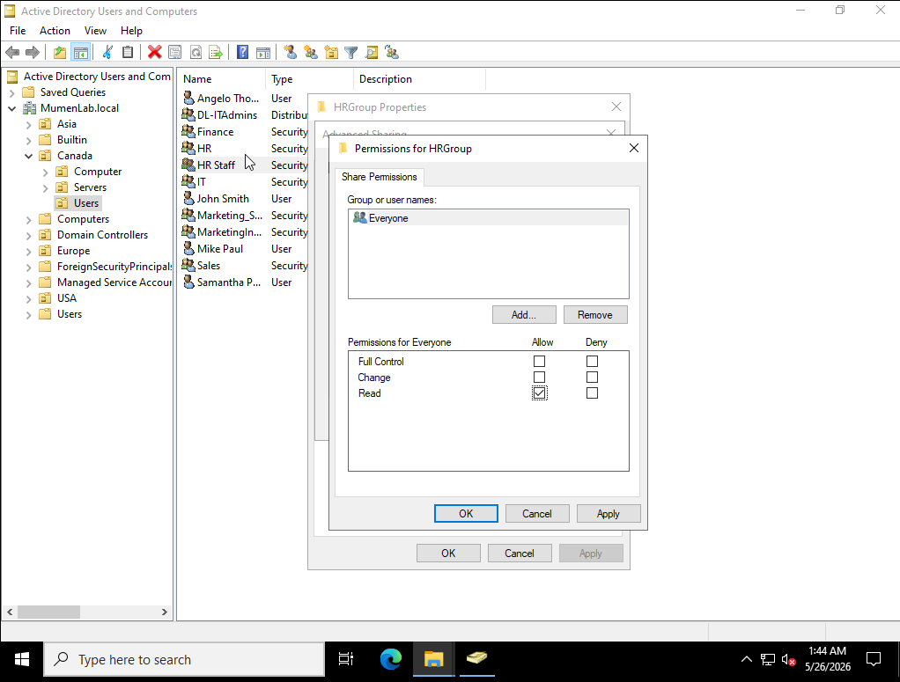

This type of scenario is common in workplaces because HR folders often contain sensitive employee information.

---

## 7. Configuring HR Share Permissions

I removed unnecessary access and configured the share permissions so only HR Staff had access.

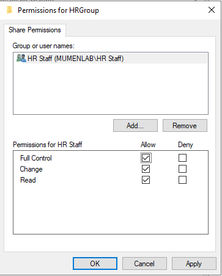

This prevents non-HR users from accessing the folder over the network.

---

## 8. Configuring HR NTFS Full Control

I also configured NTFS permissions so HR Staff had Full Control.

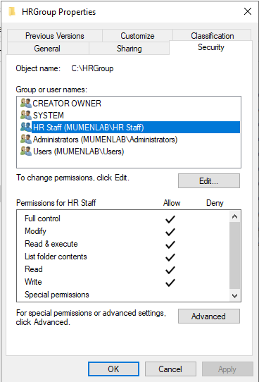

This ensures HR Staff can manage the folder contents while other users are restricted.

---

## 9. Vendor Folder Permission Scenario

The next scenario involved a third-party vendor that needed to upload files but should not be able to view other files.

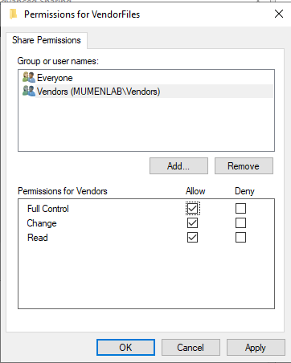

This scenario is useful for understanding how to apply limited access based on a specific business need.

---

## 10. Configuring Vendor Write-Only NTFS Access

I configured the vendor group with write-only NTFS permissions.

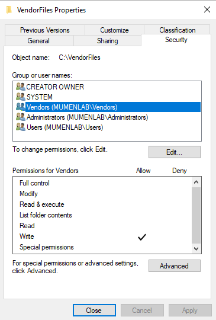

This allows the vendor to upload reports while limiting their ability to read or view existing files.

---

## 11. Software Folder Permission Scenario

The next scenario involved a Software folder used by the IT department.

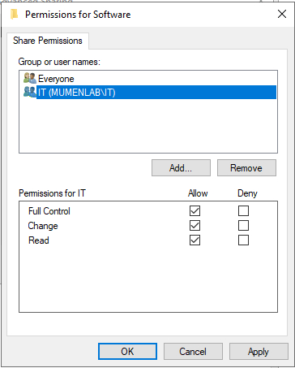

The IT department needed access to the main Software folder, but a Licenses subfolder required more restricted access.

---

## 12. Disabling Inheritance on the Licenses Folder

I disabled inheritance on the Licenses subfolder.

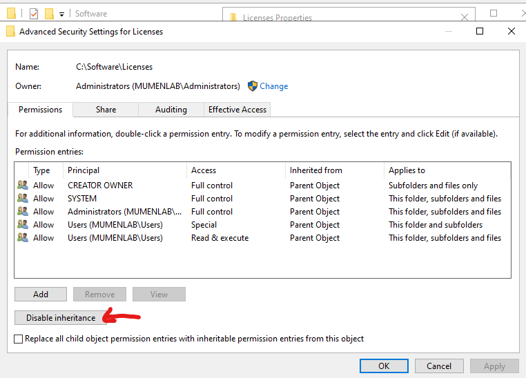

This was necessary because the Licenses folder needed different permissions from its parent Software folder.

---

## 13. Removing Inherited Permissions

After disabling inheritance, I removed inherited permissions from the Licenses folder.

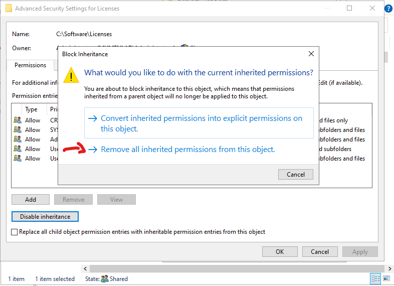

This allowed me to define a more specific access rule for the sensitive subfolder.

---

## 14. Applying Permission Changes

I applied the permission changes to the Licenses folder.

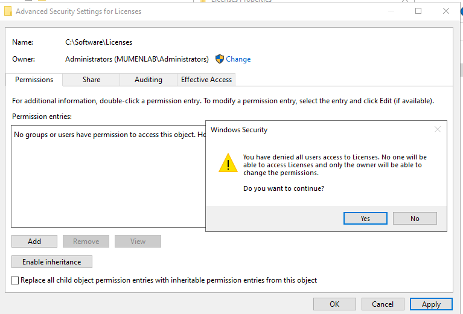

This confirmed that the inheritance and permission changes were being saved.

---

## 15. Giving Senior IT Full Control

Finally, I added the Senior IT group and gave it Full Control over the Licenses folder.

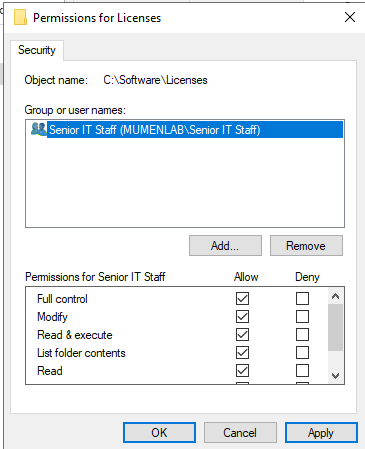

This ensures only Senior IT has access to the sensitive Licenses subfolder.

---

## Help Desk Relevance

This lab section demonstrates shared folder access tasks that are directly relevant to help desk and IT support roles.

| Help Desk / IT Task | Lab Example |
|---|---|
| Shared folder troubleshooting | Checked share and NTFS permissions |
| Read-only access | Gave Marketing Interns read-only access |
| Department access control | Restricted HR folder access to HR Staff |
| Vendor access support | Allowed vendors to upload files with limited access |
| Sensitive folder protection | Restricted Licenses folder access to Senior IT |
| Permission inheritance troubleshooting | Disabled inherited permissions on a subfolder |
| Explicit permission assignment | Added Senior IT directly to the Licenses folder |
| Least privilege access | Gave users only the access required for their role |

These are common real-world tasks when users cannot access shared folders, need access changed, or report incorrect permissions.

---

## Lessons Learned

Through this part of the lab, I learned how share permissions and NTFS permissions work together.

I also learned that NTFS permissions provide more detailed access control than share permissions. In several scenarios, the share permission allowed network access, while the NTFS permission controlled exactly what the user or group could do inside the folder.

This section also helped me understand inherited and explicit permissions. Disabling inheritance on the Licenses folder allowed me to apply a different permission structure from the parent Software folder.

The most important lesson was that permission troubleshooting requires checking both share permissions and NTFS permissions, because the most restrictive permission applies.

## Project Status

Part 7 is complete.

Completed items:

- Reviewed Marketing folder permissions
- Configured Marketing Interns read-only access
- Configured HR folder share permissions
- Configured HR Staff NTFS Full Control
- Configured vendor access to Vendor Files
- Configured vendor write-only NTFS permissions
- Configured IT access to the Software folder
- Disabled inheritance on the Licenses subfolder
- Removed inherited permissions from the Licenses subfolder
- Added Senior IT explicit Full Control permissions
